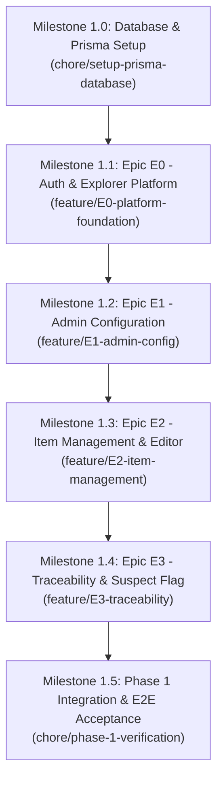

# MACRO PLAN: PHASE 1 — NỀN TẢNG DỮ LIỆU (E0 + E1 + E2 + E3)

> **Tài liệu lưu trữ:** Kế hoạch tổng thể (Macro Plan) cho toàn bộ Phase 1 của dự án AL-JAMA.
> Kế hoạch chi tiết theo từng bước triển khai cụ thể (Micro Plan) hiện tại được theo dõi trong [implementation_plan.md](file:///C:/Users/Administrator/.gemini/antigravity-ide/brain/82d7c183-3d83-4c0c-a2d4-53a924306ffd/implementation_plan.md) bắt đầu từ **Milestone 1.0 (Database Foundation) và Epic E0 (Nền tảng & Điều hướng)**.

---

## 1. Tóm tắt các Epic trong Phase 1



| Epic           | Tên Epic                  | Phạm vi chức năng chính                                                                                                                                          | BR Liên quan                 |
| :------------- | :------------------------ | :--------------------------------------------------------------------------------------------------------------------------------------------------------------- | :--------------------------- |
| **Hạ tầng DB** | Database & ORM Foundation | Schema Prisma, Migrations, Seed data (3 Item types: Requirement, Use Case, Test Case theo Q5; Users mẫu; Project mẫu). `PrismaService` & `PrismaModule`.         | A1→A10, Q5, Q8               |
| **E0**         | Nền tảng (Platform)       | Đăng nhập JWT, Profile, Project Context, Shell Layout, Explorer Tree (Folder/Item), List View (Custom columns, sort, filter), Reading View (Word-like document). | BR-NAV-01→07                 |
| **E1**         | Cấu hình Admin            | Quản lý Project, Cây Folder, Cấu hình Item Types & Custom Fields, Cấu hình Relationship Types (phrases, required/optional).                                      | BR-NAV-08, QT-03             |
| **E2**         | Quản lý Item              | Item CRUD, Rich Text Editor (Tiptap), Lock item khi sửa (QT-01), Versioning (Snapshot full, Redline/Greenline compare), Item Subscriptions, Bulk Update.         | BR-ITEM-01→09, QT-01         |
| **E3**         | Truy vết (Traceability)   | Quan hệ Upstream/Downstream, Tự động kích hoạt Suspect Flag 1 cấp (QT-02), Clear Suspect, Báo cáo Impact Analysis, Trace View dạng lưới & Export CSV.            | BR-TRACE-01→06, QT-02, QT-03 |

---

## 2. Chi tiết các Milestone

### Milestone 1.0: Database Foundation & Prisma Setup

- **Branch:** `chore/setup-prisma-database`
- **Hạ tầng:** Chạy PostgreSQL 15 & Redis 7 bằng lệnh:
  ```powershell
  docker-compose -f docker/docker-compose.dev.yml up -d
  ```
- **Prisma Schema:** Tạo đủ 26 bảng chuẩn hóa theo `Database_Schema_JAMA_Clone_MVP.md` với UUID, Soft-delete, JSONB, Snake_case mapping.
- **Seed Data:** 3 Item Types (`Requirement`, `Use Case`, `Test Case`), 3 tài khoản mẫu (`admin`, `member`, `reviewer`), 1 Project demo kèm folder tree.
- **Prisma Module:** Thiết lập `PrismaService` và `PrismaModule` trong `apps/api`.

### Milestone 1.1: Epic E0 — Nền tảng (Auth, Explorer Tree, Views)

- **Branch:** `feature/E0-platform-foundation`
- **Backend:** Auth module (JWT, Passport), User module, Project Explorer query, List View query, Reading View query. License Guard (QT-08).
- **Frontend:** Login page, App shell layout, Explorer Tree phân cấp (BR-NAV-04), List View tuỳ biến cột (BR-NAV-05), Reading View (BR-NAV-06), Search & Filter bar (BR-NAV-07).

### Milestone 1.2: Epic E1 — Cấu hình Admin

- **Branch:** `feature/E1-admin-config`
- **Backend:** Project CRUD, Folder tree management, Item Type & Custom Field configuration, Relationship Types (QT-03).
- **Frontend:** Admin settings: Folder manager, Item Type & Field builder, Relationship Type settings.

### Milestone 1.3: Epic E2 — Quản lý Item & Versioning

- **Branch:** `feature/E2-item-management`
- **Backend:** Item CRUD, Dynamic custom fields validation, Concurrency Locking (QT-01), Versioning snapshot & compare, Subscriptions, Bulk update.
- **Frontend:** Tiptap Rich Text Editor, Lock warning, Tab Versions & Redline/Greenline comparison (BR-ITEM-07), Bulk update bar.

### Milestone 1.4: Epic E3 — Truy vết & Cờ Suspect

- **Branch:** `feature/E3-traceability`
- **Backend:** Relationship CRUD, Suspect flag tự động lan đúng 1 cấp downstream (QT-02), Clear suspect, Impact Analysis BFS traversal, Trace View & CSV export.
- **Frontend:** Tab Relationships, Cờ Suspect & nút Clear, Impact Analysis tree graph, Trace View ma trận & xuất CSV.

### Milestone 1.5: Tích hợp & Nghiệm thu Phase 1 [COMPLETED]

- **Branch:** `chore/phase-1-verification`
- Chạy unit test backend (39/39 passed)
- Chạy E2E tests, nghiệm thu toàn bộ tiêu chí AC-01 (Lock item) và AC-02 (Suspect flag lan 1 cấp) (13/13 passed)
- Tự động bật Docker container (`docker-compose`) nếu chưa chạy và quản lý test DB `aljama_test`.
