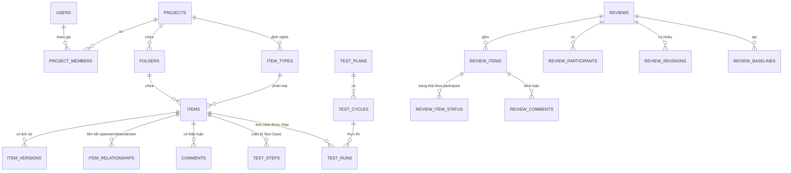

# Database Schema Design — JAMA-Clone MVP

**Nguồn:** BRD_He_thong_Quan_ly_Yeu_cau_MVP.md (v1.0, 05/09/2026)
**Phạm vi:** Toàn bộ module Chương 6.1 → 6.6 (Navigation, Item Management, Collaboration, Test Management, Traceability, Review Center)
**DB engine giả định:** PostgreSQL (do cần JSONB cho custom field, tốt cho versioning/audit)

---

## 0. Nguyên tắc thiết kế & Giả định quan trọng

Theo nguyên tắc "không tự suy diễn business rule", các điểm dưới đây được liệt kê rõ ràng vì BRD Chương 10 chưa xác nhận:

| #   | Giả định                                                                                                                                                                                                                                 | Lý do                                                                                                        | Rủi ro nếu sai                                                                                                                     |
| --- | ---------------------------------------------------------------------------------------------------------------------------------------------------------------------------------------------------------------------------------------- | ------------------------------------------------------------------------------------------------------------ | ---------------------------------------------------------------------------------------------------------------------------------- |
| A1  | **Single-tenant per deployment** — không có bảng `organizations`. Mỗi khách hàng có 1 workspace/DB riêng (theo giả định 4.1 BRD).                                                                                                        | Câu hỏi mở #8 (BRD Ch.10) chưa chốt multi-tenant. Tránh over-engineering khi chưa cần.                       | Nếu cần multi-tenant thật, phải thêm `organization_id` vào hầu hết bảng cấp cao (projects, users) — refactor tốn công nếu làm sau. |
| A2  | **Custom field của Item** lưu dạng **JSONB** (`items.custom_fields`) thay vì EAV đầy đủ. `item_type_fields` chỉ lưu **metadata/schema** để validate ở tầng application.                                                                  | Đơn giản hơn EAV, đủ linh hoạt cho MVP, tránh JOIN phức tạp khi hiển thị List View.                          | Khó filter/sort hiệu năng cao trên custom field số lượng lớn — nếu cần, bổ sung index GIN hoặc chuyển sang EAV ở giai đoạn sau.    |
| A3  | **Item Type là cấu hình theo từng Project** (`item_types.project_id` không null), chưa hỗ trợ item type dùng chung toàn tổ chức.                                                                                                         | Câu hỏi mở #5 (BRD) chưa chốt danh sách item type cụ thể.                                                    | Nếu cần item type global, thêm bảng `global_item_type_templates` để clone.                                                         |
| A4  | **Versioning lưu full snapshot** (`item_versions.snapshot` JSONB) thay vì diff từng field. Redline/greenline (BR-ITEM-07) được **tính toán ở tầng application** bằng cách so sánh 2 snapshot.                                            | Đơn giản, đúng yêu cầu "so sánh 2 version bất kỳ" mà không cần thuật toán diff lưu sẵn.                      | Snapshot lớn nếu description rich-text dài — chấp nhận được ở quy mô MVP.                                                          |
| A5  | **Soft-delete** áp dụng cho `items`, `comments` (cột `is_deleted`), **không hard-delete**, để bảo toàn version history & audit (Chương 12, 23 BRD).                                                                                      | Enterprise system cần audit trail.                                                                           | —                                                                                                                                  |
| A6  | **"Connected Users" (BR-COLLAB-07)** không có bảng riêng mà **suy ra từ `item_activity_log`** (distinct user theo item).                                                                                                                 | Tránh trùng lặp dữ liệu, activity log phục vụ luôn cho audit.                                                | Nếu cần truy vấn cực nhanh trên item có hàng nghìn tương tác, cân nhắc bảng tổng hợp (materialized view) sau.                      |
| A7  | **Review Stats (Participant Progress, Item Progress — BR-REV-27/28)** không lưu bảng riêng, **tính động** từ `review_item_status` + `review_comments`.                                                                                   | Đây là số liệu phái sinh (derived), lưu sẵn dễ lệch dữ liệu khi có revision mới.                             | —                                                                                                                                  |
| A8  | **ID dùng UUID** cho toàn bộ bảng (thay vì auto-increment) để hỗ trợ tốt cho export/share URL (BR-TRACE-06) và tránh lộ số thứ tự bản ghi.                                                                                               |                                                                                                              | Tăng nhẹ dung lượng lưu trữ index — chấp nhận được.                                                                                |
| A9  | **Test Case, Defect được mô hình hoá như một `item`** (thông qua `item_type` = "Test Case" / "Defect"), **không tách bảng riêng cho toàn bộ field** — chỉ tách bảng riêng cho phần đặc thù không thể generic hoá (test steps, test run). | Đúng tinh thần Jama: "mọi thứ đều là Item". Field mô tả, priority, assignee dùng chung cơ chế generic field. | Nếu Test Case cần logic nghiệp vụ đặc thù nặng (ví dụ versioning riêng biệt), có thể phải tách bảng độc lập sau.                   |
| A10 | Attachment lưu **path/URL trỏ đến object storage** ngoài DB (không lưu file blob trong bảng).                                                                                                                                            | Thực hành chuẩn, DB không phù hợp lưu file lớn.                                                              | —                                                                                                                                  |

---

## 1. Sơ đồ tổng quan (nhóm bảng chính)

Nhóm bảng theo module:

1. **Định danh & Phân quyền** — users, user_groups, user_group_members, project_members
2. **Cấu trúc dự án** — projects, folders, item_types, item_type_fields, relationship_types
3. **Quản lý Item** — items, item_versions, item_subscriptions, item_attachments, item_activity_log
4. **Cộng tác** — comments, comment_mentions, comment_hashtags, comment_actions
5. **Truy vết** — item_relationships
6. **Quản lý kiểm thử** — test_steps, test_plans, test_plan_testers, test_plan_cases, test_cycles, test_runs, test_run_steps, defect_test_run_links
7. **Review Center** — review_templates, reviews, review_items, review_participants, review_item_status, review_comments, review_comment_mentions, review_revisions, review_baselines, review_signatures
8. **Cross-cutting** — notifications, audit_logs

---

## 2. Chi tiết Schema

### 2.1 Định danh & Phân quyền

**`users`**

| Cột                    | Kiểu                            | Ràng buộc                 | Ghi chú                       |
| ---------------------- | ------------------------------- | ------------------------- | ----------------------------- |
| id                     | UUID                            | PK                        |                               |
| username               | VARCHAR(100)                    | UNIQUE, NOT NULL          | Dùng để đăng nhập (BR-NAV-01) |
| email                  | VARCHAR(255)                    | UNIQUE, NOT NULL          |                               |
| password_hash          | VARCHAR(255)                    | NOT NULL                  |                               |
| full_name              | VARCHAR(255)                    | NOT NULL                  |                               |
| license_type           | ENUM('full','reviewer_limited') | NOT NULL DEFAULT 'full'   | QT-08, BR-REV-04              |
| status                 | ENUM('active','inactive')       | NOT NULL DEFAULT 'active' |                               |
| created_at, updated_at | TIMESTAMP                       |                           |                               |

**`user_groups`** — id, name, description, created_at
**`user_group_members`** — group_id FK, user_id FK — PK(group_id, user_id)

**`project_members`**

| Cột          | Kiểu                           | Ràng buộc                   | Ghi chú |
| ------------ | ------------------------------ | --------------------------- | ------- |
| id           | UUID                           | PK                          |         |
| project_id   | UUID                           | FK → projects.id            |         |
| user_id      | UUID                           | FK → users.id               |         |
| project_role | ENUM('administrator','member') | NOT NULL                    | 3.2 BRD |
| joined_at    | TIMESTAMP                      |                             |         |
|              |                                | UNIQUE(project_id, user_id) |         |

> **Lưu ý phân quyền:** vai trò _Moderator/Approver/Reviewer_ KHÔNG lưu ở đây vì đó là vai trò **theo từng review**, không phải vai trò cố định trong project → xem `review_participants` (2.7).

---

### 2.2 Cấu trúc dự án

**`projects`** — id, key (VARCHAR, unique, vd "PROJ"), name, description, status, created_by FK users, created_at, updated_at

**`folders`** (Set/Explorer tree — BR-NAV-04)

| Cột              | Kiểu                        | Ghi chú         |
| ---------------- | --------------------------- | --------------- |
| id               | UUID PK                     |                 |
| project_id       | FK projects                 |                 |
| parent_folder_id | FK folders (self, nullable) | Cây phân cấp    |
| name             | VARCHAR(255)                |                 |
| order_index      | INT                         | Thứ tự hiển thị |

**`item_types`** — id, project_id FK, name, code, description, icon, created_at _(BR-NAV-08, A3)_

**`item_type_fields`** (metadata field — BR-ITEM-05)

| Cột           | Kiểu                                                                     | Ghi chú                                    |
| ------------- | ------------------------------------------------------------------------ | ------------------------------------------ |
| id            | UUID PK                                                                  |                                            |
| item_type_id  | FK item_types                                                            |                                            |
| field_key     | VARCHAR(100)                                                             | Khớp key trong `items.custom_fields` JSONB |
| field_label   | VARCHAR(255)                                                             |                                            |
| field_type    | ENUM('text','richtext','number','date','dropdown','user','multi_select') |                                            |
| is_required   | BOOLEAN                                                                  |                                            |
| options       | JSONB (nullable)                                                         | Cho dropdown/multi_select                  |
| display_order | INT                                                                      |                                            |

**`relationship_types`** (Administrator cấu hình — QT-03)

| Cột                        | Kiểu                            | Ghi chú                          |
| -------------------------- | ------------------------------- | -------------------------------- |
| id                         | UUID PK                         |                                  |
| project_id                 | FK projects (nullable = global) |                                  |
| name                       | VARCHAR(255)                    | vd "Verifies", "Implements"      |
| inverse_name               | VARCHAR(255)                    | Tên chiều ngược lại              |
| is_required_default        | BOOLEAN                         | Đường liền/đứt nét — BR-TRACE-03 |
| suspect_on_upstream_change | BOOLEAN                         | QT-02                            |

---

### 2.3 Quản lý Item

**`items`**

| Cột                                            | Kiểu                  | Ghi chú                                             |
| ---------------------------------------------- | --------------------- | --------------------------------------------------- |
| id                                             | UUID PK               |                                                     |
| project_id                                     | FK projects           |                                                     |
| folder_id                                      | FK folders (nullable) |                                                     |
| item_type_id                                   | FK item_types         |                                                     |
| item_key                                       | VARCHAR(50) UNIQUE    | vd "PROJ-123"                                       |
| name                                           | VARCHAR(500)          |                                                     |
| description                                    | TEXT                  | Rich text (HTML/JSON) — BR-ITEM-04                  |
| assignee_id                                    | FK users (nullable)   |                                                     |
| priority                                       | VARCHAR(50)           |                                                     |
| status                                         | VARCHAR(100)          | Workflow status (tuỳ cấu hình)                      |
| custom_fields                                  | JSONB                 | A2                                                  |
| current_version                                | INT                   | Đồng bộ với `item_versions.version_number` mới nhất |
| locked_by                                      | FK users (nullable)   | QT-01 — khoá khi đang sửa                           |
| locked_at                                      | TIMESTAMP (nullable)  |                                                     |
| is_deleted                                     | BOOLEAN DEFAULT false | A5                                                  |
| created_by, created_at, updated_by, updated_at |                       |                                                     |

**`item_versions`** (BR-ITEM-06, BR-ITEM-07)

| Cột            | Kiểu            | Ghi chú                             |
| -------------- | --------------- | ----------------------------------- |
| id             | UUID PK         |                                     |
| item_id        | FK items        |                                     |
| version_number | INT             | UNIQUE(item_id, version_number)     |
| snapshot       | JSONB           | Toàn bộ field tại thời điểm đó — A4 |
| change_comment | TEXT (nullable) |                                     |
| changed_by     | FK users        |                                     |
| changed_at     | TIMESTAMP       |                                     |

**`item_subscriptions`** — id, item_id FK, user_id FK, created_at — UNIQUE(item_id, user_id) _(BR-ITEM-08)_

**`item_attachments`** — id, item_id FK, file_name, file_url, mime_type, size_bytes, uploaded_by FK, uploaded_at _(BR-REV-03, A10)_

**`item_activity_log`** (nguồn cho "Connected Users" — A6)

| Cột           | Kiểu                                                                   | Ghi chú |
| ------------- | ---------------------------------------------------------------------- | ------- |
| id            | UUID PK                                                                |         |
| item_id       | FK items                                                               |         |
| user_id       | FK users                                                               |         |
| activity_type | ENUM('created','edited','commented','subscribed','mentioned','viewed') |         |
| occurred_at   | TIMESTAMP                                                              |         |

---

### 2.4 Cộng tác (Stream)

**`comments`** (dùng chung cho Stream cấp Item/Project/Organization — BR-COLLAB-01)

| Cột                    | Kiểu                                  | Ghi chú                                            |
| ---------------------- | ------------------------------------- | -------------------------------------------------- |
| id                     | UUID PK                               |                                                    |
| scope_type             | ENUM('item','project','organization') |                                                    |
| scope_id               | UUID (nullable nếu organization)      | Polymorphic, trỏ tới `items.id` hoặc `projects.id` |
| parent_comment_id      | FK comments (self, nullable)          | Reply — BR-COLLAB-05                               |
| author_id              | FK users                              |                                                    |
| content                | TEXT                                  | Có thể chứa @mention dạng markup                   |
| is_deleted             | BOOLEAN                               |                                                    |
| created_at, updated_at |                                       |                                                    |

**`comment_mentions`** — id, comment_id FK, mentioned_type ENUM('user','group','item'), mentioned_id UUID _(BR-COLLAB-02)_
**`comment_hashtags`** — id, comment_id FK, tag VARCHAR(100) _(BR-COLLAB-03 — Could)_
**`comment_actions`** — id, comment_id FK, action_text TEXT, is_resolved BOOLEAN, resolved_by FK (nullable), resolved_at (nullable) _(BR-COLLAB-04)_

---

### 2.5 Truy vết (Traceability)

**`item_relationships`**

| Cột                    | Kiểu                  | Ghi chú                                                            |
| ---------------------- | --------------------- | ------------------------------------------------------------------ |
| id                     | UUID PK               |                                                                    |
| project_id             | FK projects           |                                                                    |
| upstream_item_id       | FK items              |                                                                    |
| downstream_item_id     | FK items              |                                                                    |
| relationship_type_id   | FK relationship_types |                                                                    |
| is_suspect             | BOOLEAN DEFAULT false | QT-02 — chỉ set ở downstream trực tiếp                             |
| suspect_flagged_at     | TIMESTAMP (nullable)  |                                                                    |
| cleared_by, cleared_at | (nullable)            |                                                                    |
| created_by, created_at |                       |                                                                    |
|                        |                       | UNIQUE(upstream_item_id, downstream_item_id, relationship_type_id) |

> Trace View (BR-TRACE-06) và Impact Analysis (BR-TRACE-05) là **truy vấn/report** trên bảng này, không cần bảng riêng.

---

### 2.6 Quản lý kiểm thử

**`test_steps`** — id, test_case_item_id FK items, step_order INT, action TEXT, expected_result TEXT _(BR-TEST-01; A9)_

**`test_plans`** — id, project_id FK, name, description, environment VARCHAR, created_by, created_at _(BR-TEST-02)_
**`test_plan_testers`** — test_plan_id FK, user_id FK — PK combo
**`test_plan_cases`** — id, test_plan_id FK, test_case_item_id FK items, order_index

**`test_cycles`**

| Cột                          | Kiểu                            | Ghi chú    |
| ---------------------------- | ------------------------------- | ---------- |
| id                           | UUID PK                         |            |
| test_plan_id                 | FK test_plans                   |            |
| name                         | VARCHAR(255)                    |            |
| exclude_passed_from_cycle_id | FK test_cycles (self, nullable) | BR-TEST-03 |
| created_by, created_at       |                                 |            |

**`test_runs`**

| Cột               | Kiểu                                                       | Ghi chú    |
| ----------------- | ---------------------------------------------------------- | ---------- |
| id                | UUID PK                                                    |            |
| test_cycle_id     | FK test_cycles                                             |            |
| test_case_item_id | FK items                                                   |            |
| executed_by       | FK users (nullable)                                        |            |
| executed_at       | TIMESTAMP (nullable)                                       |            |
| overall_result    | ENUM('not_run','pass','fail','pass_with_errors','blocked') | BR-TEST-04 |

**`test_run_steps`** — id, test_run_id FK, test_step_id FK, result ENUM('not_run','pass','fail','blocked'), actual_result TEXT, notes TEXT

**`defect_test_run_links`** — id, defect_item_id FK items, test_run_id FK test_runs, test_case_item_id FK items, created_at _(BR-TEST-05 — Defect = item với item_type "Defect")_

---

### 2.7 Trung tâm Review

**`review_templates`**

| Cột                            | Kiểu                    | Ghi chú                                   |
| ------------------------------ | ----------------------- | ----------------------------------------- |
| id                             | UUID PK                 |                                           |
| project_id                     | FK projects             |                                           |
| name                           | VARCHAR(255)            |                                           |
| type                           | ENUM('approval','peer') | BR-REV-05                                 |
| requires_signature             | BOOLEAN                 |                                           |
| enable_time_tracking           | BOOLEAN                 |                                           |
| allow_approver_add_participant | BOOLEAN                 |                                           |
| allow_delegate                 | BOOLEAN                 |                                           |
| is_editable_on_create          | BOOLEAN                 | false cho Approval, true cho Peer — QT-07 |
| created_by, created_at         |                         |                                           |

**`reviews`**

| Cột                                  | Kiểu                                                                | Ghi chú         |
| ------------------------------------ | ------------------------------------------------------------------- | --------------- |
| id                                   | UUID PK                                                             |                 |
| project_id                           | FK projects                                                         |                 |
| name, description                    |                                                                     |                 |
| template_id                          | FK review_templates                                                 |                 |
| status                               | ENUM('draft','active','closed_for_feedback','archived','finalized') | BR-REV-35/36/37 |
| source_type                          | ENUM('manual','filter')                                             | BR-REV-01/02    |
| source_filter_id                     | UUID (nullable)                                                     |                 |
| deadline                             | TIMESTAMP                                                           |                 |
| current_revision_number              | INT DEFAULT 1                                                       |                 |
| created_by, created_at, finalized_at |                                                                     |                 |

**`review_items`** — id, review_id FK, item_id FK items, order_index INT DEFAULT 0, item_version_at_send_id FK item_versions (nullable), include_upstream BOOLEAN DEFAULT false, include_downstream BOOLEAN DEFAULT false _(BR-REV-04)_ — UNIQUE(review_id, item_id)

**`review_participants`**

| Cột         | Kiểu                                    | Ghi chú                    |
| ----------- | --------------------------------------- | -------------------------- |
| id          | UUID PK                                 |                            |
| review_id   | FK reviews                              |                            |
| user_id     | FK users (nullable nếu thêm theo group) |                            |
| group_id    | FK user_groups (nullable)               | BR-REV-06                  |
| review_role | ENUM('moderator','approver','reviewer') |                            |
| is_signer   | BOOLEAN DEFAULT false                   |                            |
| is_finished | BOOLEAN DEFAULT false                   |                            |
| finished_at | TIMESTAMP (nullable)                    |                            |
| invited_by  | FK users (nullable)                     |                            |
| invited_at  | TIMESTAMP DEFAULT now()                 |                            |
|             |                                         | UNIQUE(review_id, user_id) |

**`review_item_status`** — trạng thái approve/reject/reviewed, **theo từng revision** để giữ lịch sử (QT-05)

| Cột             | Kiểu                                                  | Ghi chú                                          |
| --------------- | ----------------------------------------------------- | ------------------------------------------------ |
| id              | UUID PK                                               |                                                  |
| review_item_id  | FK review_items                                       |                                                  |
| participant_id  | FK review_participants                                |                                                  |
| user_id         | FK users                                              |                                                  |
| revision_number | INT                                                   |                                                  |
| status          | ENUM('not_reviewed','reviewed','approved','rejected') | QT-04                                            |
| updated_at      | TIMESTAMP                                             |                                                  |
|                 |                                                       | UNIQUE(review_item_id, user_id, revision_number) |

> Khi publish revision mới (BR-REV-24), **không xoá dữ liệu cũ** — chỉ tạo dòng mới với `revision_number` tăng, ứng dụng chỉ đọc theo `current_revision_number` mới nhất → vừa đáp ứng "reset trạng thái" vừa giữ audit trail.

**`review_comments`**

| Cột                    | Kiểu                                                 | Ghi chú                   |
| ---------------------- | ---------------------------------------------------- | ------------------------- |
| id                     | UUID PK                                              |                           |
| review_item_id         | FK review_items                                      |                           |
| parent_comment_id      | FK review_comments (self, nullable)                  | BR-REV-12                 |
| author_id              | FK users                                             |                           |
| revision_number        | INT                                                  |                           |
| content                | TEXT                                                 |                           |
| label                  | ENUM('general','question','proposed_change','issue') | BR-REV-13                 |
| selected_text          | TEXT (nullable)                                      | Bình luận vào đoạn cụ thể |
| is_resolved            | BOOLEAN DEFAULT false                                | BR-REV-30                 |
| resolved_note          | TEXT (nullable)                                      |                           |
| resolved_by            | FK users (nullable)                                  |                           |
| resolved_at            | TIMESTAMP (nullable)                                 |                           |
| created_at, updated_at | TIMESTAMP                                            |                           |

**`review_comment_mentions`** — id, review_comment_id FK, mentioned_user_id FK _(BR-REV-16)_

**`review_revisions`** — id, review_id FK, revision_number INT, change_description TEXT (nullable), notification_sent BOOLEAN DEFAULT false, published_by FK users, published_at — UNIQUE(review_id, revision_number) _(BR-REV-32)_

**`review_baselines`**

| Cột             | Kiểu                                       | Ghi chú                                                             |
| --------------- | ------------------------------------------ | ------------------------------------------------------------------- |
| id              | UUID PK                                    |                                                                     |
| review_id       | FK reviews                                 |                                                                     |
| trigger_type    | ENUM('review_initiate','revision_publish') | BR-REV-38                                                           |
| revision_number | INT                                        |                                                                     |
| item_version_id | FK item_versions                           | FK trỏ đến version cụ thể — N rows per revision (Relational design) |
| created_at      | TIMESTAMP DEFAULT now()                    |                                                                     |
|                 |                                            | UNIQUE(review_id, revision_number, item_version_id, trigger_type)   |

**`review_signatures`** — id, review_id FK, user_id FK, signer_name VARCHAR(255), meaning VARCHAR(255), reauth_confirmed BOOLEAN DEFAULT false, signed_at TIMESTAMP _(BR-REV-22)_

---

### 2.8 Cross-cutting

**`notifications`** — id, user_id FK, type VARCHAR, related_entity_type VARCHAR, related_entity_id UUID, title, message, is_read BOOLEAN, created_at

**`audit_logs`** — id, entity_type VARCHAR, entity_id UUID, action VARCHAR, actor_id FK users (nullable), before_value JSONB (nullable), after_value JSONB (nullable), created_at

> Áp dụng cho các hành động nhạy cảm: sửa item, đổi permission, approve/reject, publish revision, finalize review (Chương 23 BRD).

---

## 3. Bảng ánh xạ Yêu cầu → Bảng dữ liệu (trích các nhóm chính)

| Nhóm BR      | Bảng liên quan chính                                                                  |
| ------------ | ------------------------------------------------------------------------------------- |
| BR-NAV-*     | projects, folders, item_types, items                                                  |
| BR-ITEM-*    | items, item_versions, item_type_fields, item_subscriptions                            |
| BR-COLLAB-*  | comments, comment_mentions, comment_hashtags, comment_actions, item_activity_log      |
| BR-TEST-*    | test_steps, test_plans, test_cycles, test_runs, test_run_steps, defect_test_run_links |
| BR-TRACE-*   | item_relationships, relationship_types                                                |
| BR-REV-01→09 | review_templates, reviews, review_items, review_participants                          |
| BR-REV-10→24 | review_comments, review_item_status, review_signatures                                |
| BR-REV-25→37 | review_participants, review_item_status, review_comments, review_revisions            |
| BR-REV-38→41 | review_baselines                                                                      |

---

## 4. Index & Ràng buộc quan trọng

- `items(project_id, folder_id)`, `items(item_type_id)`, `items(assignee_id)` — phục vụ List View & filter (BR-NAV-05/07).
- `items USING GIN (custom_fields)` — filter trên custom field (Postgres JSONB index).
- `item_relationships(upstream_item_id)`, `item_relationships(downstream_item_id)` — Impact Analysis/Trace View cần truy vấn 2 chiều nhanh.
- `comments(scope_type, scope_id)` — load Stream theo item/project.
- `review_item_status(review_id, revision_number)` — Stats tab cần group theo revision hiện tại.
- Unique constraint `items.item_key`, `test_cycles/test_plans` không cần unique tên (cho phép trùng tên khác project).
- FK `items.locked_by` cần được **clear tự động** khi hết phiên chỉnh sửa (application logic, không phải DB constraint) — QT-01.

---

## 5. Vấn đề cần khách hàng xác nhận thêm (ảnh hưởng trực tiếp tới schema)

Các câu hỏi mở ở BRD Chương 10 sẽ ảnh hưởng schema như sau nếu câu trả lời khác giả định ở Mục 0:

| Câu hỏi BRD                          | Ảnh hưởng schema nếu thay đổi                                                                                                                                  |
| ------------------------------------ | -------------------------------------------------------------------------------------------------------------------------------------------------------------- |
| #1 Test Management có vào MVP không? | Nếu bỏ → loại bỏ 8 bảng nhóm 2.6 khỏi đợt release đầu.                                                                                                         |
| #3 Mô hình phân quyền đơn giản hoá?  | Có thể gộp `review_role` vào enum có sẵn của `project_role`, giảm 1 bảng.                                                                                      |
| #5 Danh sách item type cụ thể?       | Cần xác nhận trước khi seed dữ liệu `item_types`/`item_type_fields` mẫu.                                                                                       |
| #8 Multi-tenant?                     | Nếu có → thêm `organization_id` vào `users`, `projects`, và toàn bộ bảng cấp cao — nên xác nhận SỚM vì đây là thay đổi tốn công nếu làm sau khi đã có dữ liệu. |

---

_Tài liệu này ở mức thiết kế logic (logical schema) — chưa bao gồm DDL/migration script cụ thể theo ORM/framework sẽ dùng. Khi chốt được câu hỏi mở ở Mục 5, nên cập nhật lại trước khi implement._
