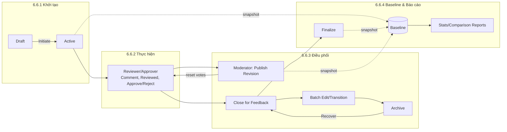
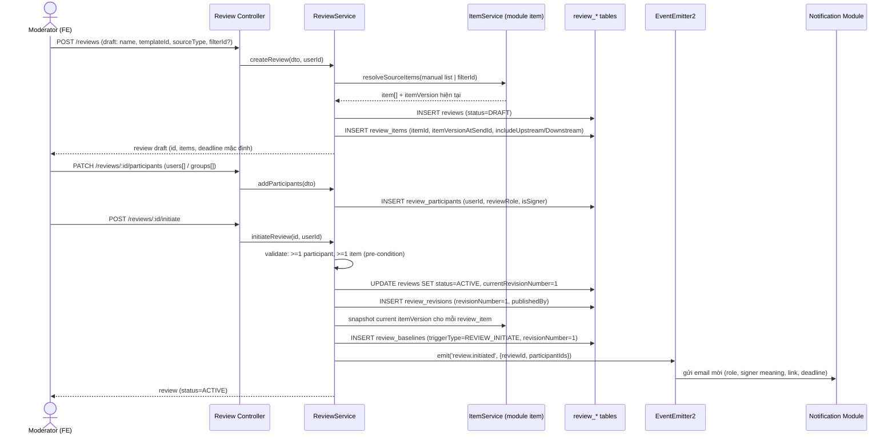
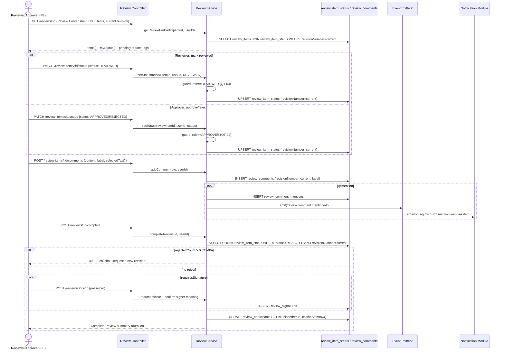
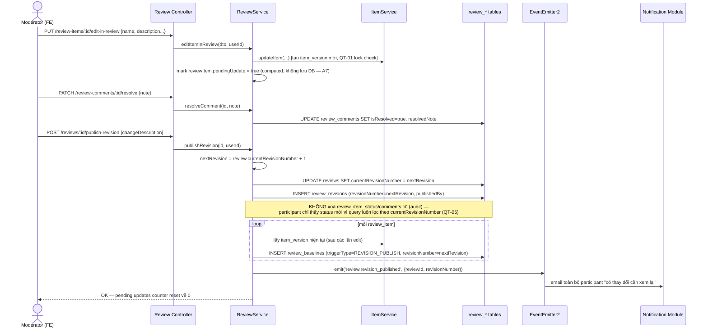
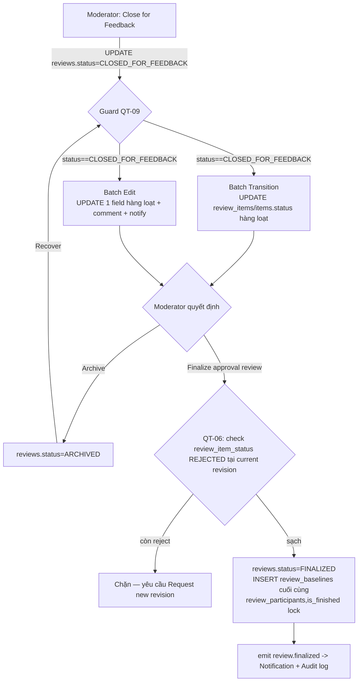
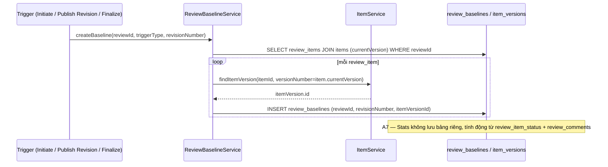

# Review Center — User Stories & Data Flow

**Nguồn căn cứ:** `docs/requirements/BRD_He_thong_Quan_ly_Yeu_cau_MVP.md` (Chương 6.6, BR-REV-01 → BR-REV-41), `docs/requirements/Database_Schema_JAMA_Clone_MVP.md`, `apps/api/prisma/schema.prisma` (models `Review*`).
**Kiến trúc tham chiếu:** Modular Monolith — module `review` (chưa có code, mới có schema) sẽ sở hữu 10 bảng: `review_templates, reviews, review_items, review_participants, review_item_status, review_comments, review_comment_mentions, review_revisions, review_baselines, review_signatures`. Module này phụ thuộc (qua service, không đụng bảng) vào module `item` (items, item_versions) và phát event cho `notification`/`audit`.

> Ký hiệu actor: **M** = Moderator, **A** = Approver, **R** = Reviewer, **Adm** = Administrator, **Sys** = System/Background job.

---

## 0. Sơ đồ tổng quan vòng đời Review (bối cảnh cho toàn bộ data flow bên dưới)



---

## 6.6.1 KHỞI TẠO REVIEW (BR-REV-01 → 09)

### User Stories

| # | User Story | BR liên quan |
|---|---|---|
| US-01 | Là **Moderator**, tôi muốn khởi tạo review từ tab "Reviews" bằng nút "Start a Review" để chủ động gửi bất kỳ tập item nào đi review. | BR-REV-01 |
| US-02 | Là **Project Member**, tôi muốn right-click 1 item trong Explorer > "Send for review" để nhanh chóng gửi 1 item đi review mà không cần mở wizard đầy đủ. | BR-REV-01 |
| US-03 | Là **Moderator**, tôi muốn tạo review từ một filter đã lưu (rolling review) để tự động review mọi item đang ở 1 workflow status cụ thể mà không phải chọn tay từng item. | BR-REV-01, BR-REV-02 |
| US-04 | Là **Moderator**, khi tạo từ filter, tôi muốn hệ thống tự đặt tên review theo tên filter và deadline mặc định = 1 tuần để tôi không mất thời gian nhập liệu. | BR-REV-02 |
| US-05 | Là **Moderator**, tôi muốn đính kèm file có sẵn của item vào review để reviewer xem thêm tài liệu hỗ trợ (Excel, bản vẽ...). | BR-REV-03 |
| US-06 | Là **Moderator**, tôi muốn bật tuỳ chọn hiển thị item Upstream/Downstream liên quan để Reviewer có đủ ngữ cảnh, đặc biệt với license Reviewer hạn chế (QT-08). | BR-REV-04 |
| US-07 | Là **Moderator**, tôi muốn chọn template "Approval Review" (khoá cấu hình, bắt buộc ký điện tử) hoặc "Peer Review" (được tuỳ chỉnh) để review đúng mục đích phê duyệt hay góp ý. | BR-REV-05, QT-07 |
| US-08 | Là **Moderator**, tôi muốn thêm participant theo cá nhân hoặc theo cả nhóm (user group), hệ thống tự gán vai trò nếu người dùng chỉ thuộc 1 nhóm. | BR-REV-06 |
| US-09 | Là **Approver**, tôi cần được phân biệt rõ với Reviewer để hệ thống biết tôi có quyền Approve/Reject còn Reviewer thì không (QT-04). | BR-REV-07 |
| US-10 | Là **Moderator**, tôi muốn tuỳ chỉnh nội dung email mời trước khi gửi để phù hợp giọng văn tổ chức. | BR-REV-08 |
| US-11 | Là **Moderator**, khi tôi bấm "Initiate", tôi muốn hệ thống tự tạo revision đầu tiên và gửi email cho toàn bộ participant ngay lập tức. | BR-REV-09 |

### Data Flow — Tạo & Khởi tạo Review



**Bảng dữ liệu chạm tới:** `reviews`, `review_items`, `review_participants`, `review_revisions`, `review_baselines` (ghi); `items`, `item_versions`, `relationship_types`/`item_relationships` (đọc, để lấy upstream/downstream context — BR-REV-04); `notifications` (ghi, qua event, không gọi trực tiếp — đúng nguyên tắc module boundary trong AGENTS.md).

**Ghi chú thiết kế:** Khi nguồn là `filter` (BR-REV-02), `reviews.source_type='filter'` và `source_filter_id` khoá project/item list lại (FE disable việc thêm/bớt thủ công).

---

## 6.6.2 THỰC HIỆN REVIEW — Reviewer / Approver (BR-REV-10 → 24)

### User Stories

| # | User Story | BR liên quan |
|---|---|---|
| US-12 | Là **Reviewer/Approver**, tôi muốn bấm link trong email mời để mở thẳng vào review mà không cần điều hướng thủ công. | BR-REV-10 |
| US-13 | Là **Reviewer/Approver**, tôi muốn có Summary/Table of Contents/Search ở cột trái để định vị nhanh trong review có nhiều item. | BR-REV-11 |
| US-14 | Là **Reviewer**, tôi muốn bôi chọn 1 đoạn nội dung cụ thể để bình luận chính xác, hoặc bình luận chung cho cả item. | BR-REV-12 |
| US-15 | Là **Reviewer/Approver**, tôi muốn gắn nhãn bình luận (General/Question/Proposed change/Issue) để Moderator dễ lọc và xử lý. | BR-REV-13 |
| US-16 | Là **Reviewer**, tôi muốn tick "đã xem" cho từng item hoặc cả trang để ghi nhận tiến độ cá nhân — tôi KHÔNG có quyền approve/reject (QT-04). | BR-REV-14, QT-04 |
| US-17 | Là **Approver**, tôi muốn toggle Approve/Reject từng item, hoặc dùng batch action cho cả trang khi đã review offline trước đó. | BR-REV-15 |
| US-18 | Là **participant**, tôi muốn @mention đồng nghiệp trong bình luận để họ nhận email và mở thẳng tới item đó. | BR-REV-16 |
| US-19 | Là **participant**, tôi muốn xem trước file đính kèm (Excel...) ngay trong review, không cần tải về. | BR-REV-17 |
| US-20 | Là **participant**, khi Moderator publish version mới, tôi muốn thấy icon lịch cạnh item và bấm vào để xem redline/greenline so với bản cũ tôi đã đọc. | BR-REV-18 |
| US-21 | Là **participant**, tôi muốn lọc chỉ hiển thị item "cần review" hoặc "đã cập nhật từ lần trước" để không phải đọc lại toàn bộ. | BR-REV-19 |
| US-22 | Là **participant**, khi đã xử lý xong mọi item, tôi muốn xem trang "Complete Review" tổng kết thời lượng, số bình luận, số approve/reject. | BR-REV-20 |
| US-23 | Là **Approver**, nếu còn item bị reject, tôi muốn hệ thống chặn ký điện tử và chỉ cho tôi chọn "Request a new revision" (QT-06). | BR-REV-21 |
| US-24 | Là **Approver-signer**, khi hoàn tất, tôi muốn hệ thống bắt tôi re-authenticate và xác nhận ý nghĩa chữ ký trước khi lưu. | BR-REV-22 |
| US-25 | Là **user bất kỳ**, tôi muốn trang chủ hiển thị nhanh review đang active cần tôi xử lý. | BR-REV-23 |
| US-26 | Là **participant**, mỗi khi Moderator publish revision mới, tôi hiểu rằng mọi vote/trạng thái đã xem trước đó của tôi bị reset — tôi phải làm lại từ đầu trên nội dung mới (QT-05). | BR-REV-24, QT-05 |

### Data Flow — Comment / Mark Reviewed / Approve-Reject



**Bảng dữ liệu chạm tới:** `review_item_status` (ghi theo `revisionNumber` — không xoá dữ liệu cũ, đúng A7/QT-05), `review_comments`, `review_comment_mentions`, `review_signatures`, `review_participants` (đọc/ghi `isFinished`).

**Business rule nhúng trong flow:** QT-04 (tách bộ trạng thái Reviewer/Approver ở tầng guard service), QT-06 (chặn hoàn tất khi còn reject), QT-05 (mọi query trạng thái đều lọc theo `review.currentRevisionNumber`).

---

## 6.6.3 ĐIỀU PHỐI REVIEW — Moderator (BR-REV-25 → 37)

### User Stories

| # | User Story | BR liên quan |
|---|---|---|
| US-27 | Là **Moderator**, tôi muốn thêm/bớt Moderator khác cho review đang mở để chia sẻ khối lượng điều phối. | BR-REV-25 |
| US-28 | Là **Moderator**, tôi muốn thêm participant mới vào review đang chạy và họ nhận được email thông báo ngay. | BR-REV-26 |
| US-29 | Là **Moderator**, tôi muốn xem Participant Progress (ai đã approve/reject/finished bao nhiêu) để biết ai đang chậm trễ. | BR-REV-27 |
| US-30 | Là **Moderator**, tôi muốn xem Item Progress (từng item đang ở trạng thái gì, bao nhiêu comment) để biết item nào còn tranh cãi. | BR-REV-28 |
| US-31 | Là **Moderator**, tôi muốn có 1 Feedback tab tổng hợp mọi bình luận, lọc theo nhãn (proposed change...), @mention và trả lời ngay tại đây. | BR-REV-29 |
| US-32 | Là **Moderator**, tôi muốn sửa nội dung item ngay trong Single Item View để xử lý "proposed change", rồi Resolve kèm ghi chú. | BR-REV-30 |
| US-33 | Là **Moderator**, tôi muốn thấy số lượng "pending updates" (item đã sửa nhưng participant chưa thấy) để biết khi nào cần publish revision. | BR-REV-31 |
| US-34 | Là **Moderator**, tôi muốn Publish New Revision để thông báo toàn bộ participant có thay đổi cần xem lại, và so sánh v8 vs v3 bất kỳ lúc nào. | BR-REV-32 |
| US-35 | Là **Moderator**, tôi muốn chọn nhiều item và chuyển trạng thái hàng loạt (batch transition). | BR-REV-33 |
| US-36 | Là **Moderator**, tôi muốn sửa hàng loạt 1 trường dữ liệu (batch edit) kèm bình luận và gửi thông báo tới nhóm liên quan. | BR-REV-34 |
| US-37 | Là **Moderator**, tôi muốn "Close for Feedback" để khoá review trước khi làm các thao tác quản trị hàng loạt (QT-09). | BR-REV-35, QT-09 |
| US-38 | Là **Moderator**, tôi muốn Archive review đã đóng, và có thể Recover lại nếu cần thu thập thêm feedback. | BR-REV-36 |
| US-39 | Là **Moderator**, tôi muốn Finalize Approval Review khi mọi việc đã xong để chốt baseline cuối cùng và đóng review vĩnh viễn. | BR-REV-37 |

### Data Flow — Publish Revision (trung tâm của nhóm Điều phối)



### Data Flow — Close for Feedback → Batch Ops → Archive/Finalize



**Bảng dữ liệu chạm tới:** `reviews` (status transitions), `review_revisions`, `review_baselines`, `review_comments` (resolve), `review_item_status` (đọc để guard Finalize), `items`/`item_versions` (qua ItemService khi Moderator sửa item hoặc batch edit/transition), `audit_logs` (ghi khi Finalize — hành động nhạy cảm theo Chương 23 BRD).

**State machine áp dụng (đối chiếu Mục 3.1 MVP Delivery Plan):**
```
draft → active → closed_for_feedback → finalized
                          ↕
                      archived
```
Transition không hợp lệ cần chặn ở service: `active → finalized` (phải qua `closed_for_feedback`), `finalized → *`.

---

## 6.6.4 BASELINE & BÁO CÁO (BR-REV-38 → 41)

### User Stories

| # | User Story | BR liên quan |
|---|---|---|
| US-40 | Là **hệ thống**, mỗi khi review được initiate hoặc publish revision, tôi tự động tạo 1 Baseline (snapshot) để phục vụ đối chiếu sau này — không cho user tạo tay. | BR-REV-38 |
| US-41 | Là **Moderator/Admin**, tôi muốn chạy "Review Center Stats Report" cho 1 review cụ thể để xuất toàn bộ số liệu feedback đã thu thập. | BR-REV-39 |
| US-42 | Là **Moderator/Admin**, tôi muốn chọn 1 baseline (vd version 1) và so sánh với hiện tại, tuỳ chọn bao gồm relationships/version comments. | BR-REV-40 |
| US-43 | Là **Moderator/Admin/Auditor**, tôi muốn xem "Baseline Comparison Report" chi tiết mọi thay đổi giữa baseline và hiện tại phục vụ audit. | BR-REV-41 |

### Data Flow — Baseline Auto-creation & Reporting



```mermaid
flowchart LR
    subgraph ReportParams["Report Parameters (chọn tại UI)"]
        R1[Chọn Review] --> R2["Review Center Stats Report\n(BR-REV-39)"]
        R3[Chọn Baseline vd v1] --> R4["Compare to current\n+ include relationships/version comments\n(BR-REV-40)"]
    end
    R2 --> Q2[Query: review_item_status + review_comments\nGROUP BY participant/item]
    R4 --> Q4[Query: review_baselines(v1).itemVersionIds\n  vs items.currentVersion\n  diff qua ItemService.compareVersions]
    Q2 --> OUT2[Xuất báo cáo Stats: Participant/Item Progress]
    Q4 --> OUT4["Baseline Comparison Report\n(BR-REV-41): redline/greenline + relationship diff"]
```

**Bảng dữ liệu chạm tới:** `review_baselines` (ghi tự động, đọc khi báo cáo), `item_versions` (đọc qua FK `item_version_id`), `review_item_status` + `review_comments` (đọc, aggregate — không có bảng stats riêng theo giả định A7).

---

## Tổng hợp Module → Bảng dữ liệu (Review Center)

| Nhóm chức năng | Bảng ghi chính | Bảng đọc phụ thuộc (module khác) |
|---|---|---|
| 6.6.1 Khởi tạo | reviews, review_items, review_participants, review_revisions(rev.1), review_baselines(rev.1) | items, item_versions, item_relationships |
| 6.6.2 Thực hiện | review_item_status, review_comments, review_comment_mentions, review_signatures | item_versions (redline khi so sánh) |
| 6.6.3 Điều phối | reviews(status), review_revisions, review_baselines, review_comments(resolve) | items, item_versions (edit-in-review, batch edit/transition), audit_logs |
| 6.6.4 Baseline/Báo cáo | review_baselines (ghi tự động) | item_versions, review_item_status, review_comments (đọc để tổng hợp) |

## Sự kiện (Event) phát sinh cross-module

| Event | Khi nào | Consumer |
|---|---|---|
| `review.initiated` | Sau initiate | Notification (email mời) |
| `review.participant_added` | Moderator thêm participant giữa chừng | Notification |
| `review.comment.mentioned` | Comment có @mention | Notification |
| `review.revision_published` | Publish revision | Notification, đồng thời FE invalidate cache "pending updates" |
| `review.closed_for_feedback` | Close for Feedback | Audit log |
| `review.finalized` | Finalize | Notification, Audit log |
| `review.archived` / `review.recovered` | Archive / Recover | Audit log |

## Business rule tổng hợp áp dụng xuyên suốt data flow

- **QT-04**: tách guard theo `review_role` — Reviewer chỉ set `REVIEWED`, Approver chỉ set `APPROVED/REJECTED`.
- **QT-05**: publish revision không xoá `review_item_status`/`review_comments` cũ — mọi read-path lọc theo `reviews.current_revision_number`.
- **QT-06**: `completeReview`/`finalize` luôn COUNT `review_item_status.status = REJECTED` tại revision hiện tại trước khi cho phép ký/finalize.
- **QT-07**: `review_templates.is_editable_on_create=false` cho Approval → wizard FE khoá field khi `templateType=APPROVAL`.
- **QT-08**: `review_items.include_upstream/include_downstream` bắt buộc cân nhắc khi participant có `license_type=REVIEWER_LIMITED`.
- **QT-09**: mọi batch edit/transition endpoint guard `reviews.status === CLOSED_FOR_FEEDBACK`.

## Open Questions (chưa chốt, ảnh hưởng trực tiếp data flow ở trên)

1. Q3 (permission model): review_role hiện độc lập với project_role — cần xác nhận có cho phép 1 project_member không thuộc participant nào vẫn xem review không (ảnh hưởng guard ở bước `GET /reviews/:id`).
2. Q6 (độ phức tạp filter cho rolling review — BR-REV-01c): ảnh hưởng trực tiếp bước `resolveSourceItems(filterId)` trong flow Khởi tạo — hiện giả định dùng filter/status dựng sẵn.
3. Q7 (SMTP thật hay mô phỏng): ảnh hưởng độ tin cậy của mọi bước `Evt → Notif` trong các flow trên.